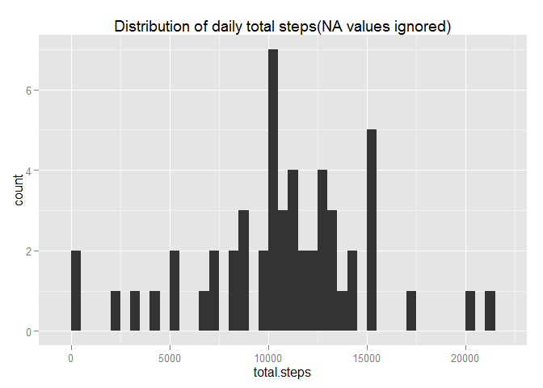
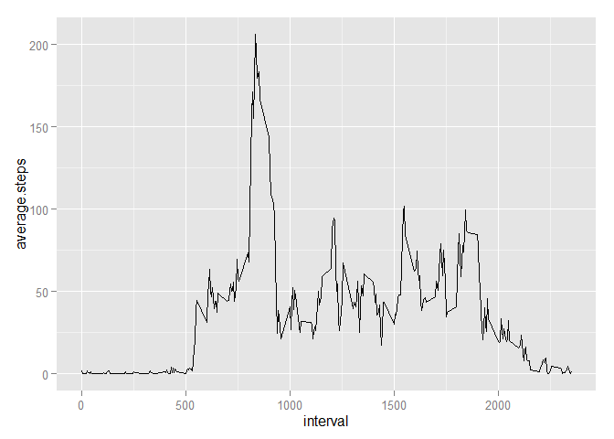
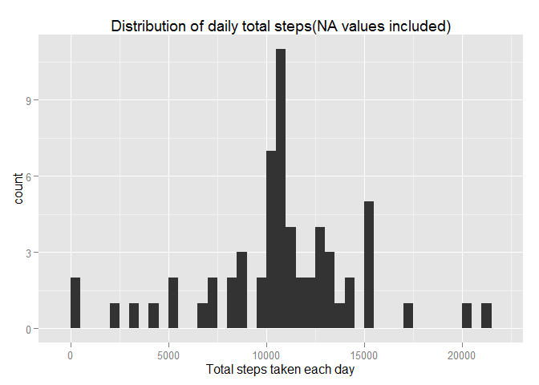
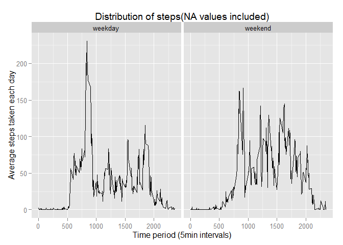

<h3>
<b>Introduction</b>
</h3>

It is now possible to collect a large amount of data about personal
movement using activity monitoring devices such as a
<a href="http://www.fitbit.com">Fitbit</a>,
<a href="http://www.nike.com/us/en_us/c/nikeplus-fuelband">Nike
Fuelband</a>, or <a href="https://jawbone.com/up">Jawbone Up</a>. These
type of devices are part of the "quantified self" movement - a group of
enthusiasts who take measurements about themselves regularly to improve
their health, to find patterns in their behavior, or because they are
tech geeks. But these data remain under-utilized both because the raw
data are hard to obtain and there is a lack of statistical methods and
software for processing and interpreting the data.

This assignment makes use of data from a personal activity monitoring
device. This device collects data at 5 minute intervals through out the
day. The data consists of two months of data from an anonymous
individual collected during the months of October and November, 2012 and
include the number of steps taken in 5 minute intervals each day.

<h3>
<b>Data</b>
</h3>

The data for this assignment can be downloaded from the course web site:

<ul>
<li>
Dataset:
<a href="https://d396qusza40orc.cloudfront.net/repdata%2Fdata%2Factivity.zip">Activity
monitoring data</a> [52K]
</li>
</ul>

The variables included in this dataset are:

<ul>
<li>

<b>steps</b>: Number of steps taking in a 5-minute interval (missing
values are coded as <code>NA</code>)

</li>
<li>

<b>date</b>: The date on which the measurement was taken in YYYY-MM-DD
format

</li>
<li>

<b>interval</b>: Identifier for the 5-minute interval in which
measurement was taken

</li>
</ul>

The dataset is stored in a comma-separated-value (CSV) file and there
are a total of 17,568 observations in this dataset.

<h3>
<b>Analysis</b>
</h3>
<b>
<li>

Loading and preprocessing the data</b>
</li>

Show any code that is needed to

1.  Load the data (i.e. <code>read.csv()</code>)
2.  Process/transform the data (if necessary) into a format suitable for
    your analysis

<!-- -->

    activity<-read.csv("activity.csv")
    head(activity)

    ##   steps       date interval
    ## 1    NA 2012-10-01        0
    ## 2    NA 2012-10-01        5
    ## 3    NA 2012-10-01       10
    ## 4    NA 2012-10-01       15
    ## 5    NA 2012-10-01       20
    ## 6    NA 2012-10-01       25

    str(activity)

    ## 'data.frame':    17568 obs. of  3 variables:
    ##  $ steps   : int  NA NA NA NA NA NA NA NA NA NA ...
    ##  $ date    : Factor w/ 61 levels "2012-10-01","2012-10-02",..: 1 1 1 1 1 1 1 1 1 1 ...
    ##  $ interval: int  0 5 10 15 20 25 30 35 40 45 ...

<b>
<li>

What is mean total number of steps taken per day?</b>
</li>

For this part of the assignment, you can ignore the missing values in
the dataset.

1.  Calculate the total number of steps taken per day

<!-- -->

    library(dplyr)

    ## 
    ## Attaching package: 'dplyr'
    ## 
    ## The following objects are masked from 'package:stats':
    ## 
    ##     filter, lag
    ## 
    ## The following objects are masked from 'package:base':
    ## 
    ##     intersect, setdiff, setequal, union

    total_steps <- activity %>% 
         group_by(date) %>% 
         summarise(sum(steps, na.rm=TRUE))
    names(total_steps)[2]<-"total.steps"
    total_steps<-filter(total_steps,!total.steps==0)
    head(total_steps)

    ## Source: local data frame [6 x 2]
    ## 
    ##         date total.steps
    ## 1 2012-10-02         126
    ## 2 2012-10-03       11352
    ## 3 2012-10-04       12116
    ## 4 2012-10-05       13294
    ## 5 2012-10-06       15420
    ## 6 2012-10-07       11015

1.  If you do not understand the difference between a histogram and a
    barplot, research the difference between them. Make a histogram of
    the total number of steps taken each day

<!-- -->

    library(ggplot2)
    qplot(total.steps, data = total_steps, geom = "histogram", binwidth=500, main = "Distribution of daily total steps(NA values ignored)")

1.  Calculate and report the mean and median of the total number of
    steps taken per day

<!-- -->

    summary(total_steps$total.steps)

    ##    Min. 1st Qu.  Median    Mean 3rd Qu.    Max. 
    ##      41    8841   10760   10770   13290   21190

<b>
<li>

What is the average daily activity pattern?</b>
</li>

1.  Make a time series plot (i.e. <code>type = "l"</code>) of the
    5-minute interval (x-axis) and the average number of steps taken,
    averaged across all days (y-axis)

<!-- -->

    average_steps<-tapply(activity$steps, activity$interval, mean, na.rm=TRUE)
    average_steps<-data.frame(interval=as.numeric(names(average_steps)), average.steps=average_steps)
    head(average_steps)

    ##    interval average.steps
    ## 0         0     1.7169811
    ## 5         5     0.3396226
    ## 10       10     0.1320755
    ## 15       15     0.1509434
    ## 20       20     0.0754717
    ## 25       25     2.0943396

    ggplot(average_steps, aes(x=interval, y=average.steps))+geom_line()

1.  Which 5-minute interval, on average across all the days in the
    dataset, contains the maximum number of steps?

<!-- -->

    average_steps[which.max(average_steps$average.steps),]

    ##     interval average.steps
    ## 835      835      206.1698

<b>
<li>

Imputing missing values</b>
</li>

Note that there are a number of days/intervals where there are missing
values (coded as <code>NA</code>). The presence of missing days may
introduce bias into some calculations or summaries of the data.

1.  Calculate and report the total number of missing values in the
    dataset (i.e. the total number of rows with <code>NA</code>s)
    

<!-- -->

    sum(is.na(activity$steps))

    ## [1] 2304

1.  Devise a strategy for filling in all of the missing values in the
    dataset. The strategy does not need to be sophisticated. For
    example, you could use the mean/median for that day, or the mean for
    that 5-minute interval, etc.
    

1.  Create a new dataset that is equal to the original dataset but with
    the missing data filled in.
    

<!-- -->

    filled_activity<-activity
    na_values<-is.na(filled_activity$steps)
    average_steps_list<-tapply(filled_activity$steps, filled_activity$interval, mean, na.rm=TRUE)
    filled_activity$steps[na_values]<-average_steps_list[as.character(filled_activity$interval[na_values])]
    head(filled_activity)

    ##       steps       date interval
    ## 1 1.7169811 2012-10-01        0
    ## 2 0.3396226 2012-10-01        5
    ## 3 0.1320755 2012-10-01       10
    ## 4 0.1509434 2012-10-01       15
    ## 5 0.0754717 2012-10-01       20
    ## 6 2.0943396 2012-10-01       25

1.  Make a histogram of the total number of steps taken each day and
    Calculate and report the <b>mean</b> and <b>median</b> total number
    of steps taken per day. Do these values differ from the estimates
    from the first part of the assignment? What is the impact of
    imputing missing data on the estimates of the total daily number of
    steps?
    

<b> Histogram becomes more concentrated around the mean. </b>

    total_steps_2 <- filled_activity %>%
      group_by(date) %>%
      summarise(sum(steps))
    names(total_steps_2)[2]<-"total.steps"
    head(total_steps_2)

    ## Source: local data frame [6 x 2]
    ## 
    ##         date total.steps
    ## 1 2012-10-01    10766.19
    ## 2 2012-10-02      126.00
    ## 3 2012-10-03    11352.00
    ## 4 2012-10-04    12116.00
    ## 5 2012-10-05    13294.00
    ## 6 2012-10-06    15420.00

    ggplot(total_steps_2, aes(total.steps)) + geom_histogram(binwidth=500) + labs(title="Distribution of daily total steps(NA values included)",x="Total steps taken each day")

<b>
<li>

Are there differences in activity patterns between weekdays and
weekends?</b>
</li>

For this part the <code>weekdays()</code> function may be of some help
here. Use the dataset with the filled-in missing values for this part.

<ol>
<li>

Create a new factor variable in the dataset with two levels - "weekday"
and "weekend" indicating whether a given date is a weekday or weekend
day.

</li>
    new<-mutate(filled_activity,date=as.Date(date))
    which_day <- function(d) {
        weekend <- weekdays(d)
        ifelse (weekend == "Saturday" | weekend == "Sunday", "weekend", "weekday")
    }
    weekday_weekend <- sapply(new$date, which_day)
    new<-mutate(new, weekday_weekend=as.factor(weekday_weekend))
    head(new)

    ##       steps       date interval weekday_weekend
    ## 1 1.7169811 2012-10-01        0         weekday
    ## 2 0.3396226 2012-10-01        5         weekday
    ## 3 0.1320755 2012-10-01       10         weekday
    ## 4 0.1509434 2012-10-01       15         weekday
    ## 5 0.0754717 2012-10-01       20         weekday
    ## 6 2.0943396 2012-10-01       25         weekday

<li>

Make a panel plot containing a time series plot (i.e. <code>type =
"l"</code>) of the 5-minute interval (x-axis) and the average number of
steps taken, averaged across all weekday days or weekend days (y-axis).
See the README file in the GitHub repository to see an example of what
this plot should look like using simulated data.

    final_data <- aggregate(steps ~ weekday_weekend+interval, data=new, FUN=mean)
    head(final_data)

    ##   weekday_weekend interval      steps
    ## 1         weekday        0 2.25115304
    ## 2         weekend        0 0.21462264
    ## 3         weekday        5 0.44528302
    ## 4         weekend        5 0.04245283
    ## 5         weekday       10 0.17316562
    ## 6         weekend       10 0.01650943

    ggplot(final_data, aes(x=interval, y=steps)) + geom_line() + facet_grid(. ~ weekday_weekend) + labs(title="Distribution of steps(NA values included)",y="Average steps taken each day",x="Time period (5min intervals)")

